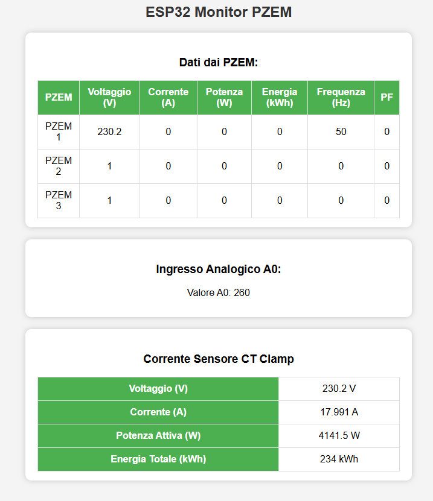

# ESP32-C3 + Arduino Nano + PZEM-004T: Energy Monitoring with MQTT

This project uses an **ESP32-C3** and an **Arduino Nano** to monitor energy consumption using multiple **PZEM-004T** sensors. Data is transmitted via **UART** from the Arduino Nano to the ESP32-C3, which then publishes the data via **MQTT** with support for **Home Assistant Auto Discovery**.

---
## 📌 **Features**
✅ **Real-time energy monitoring** with up to **3 PZEM-004T** sensors.  
✅ **Web interface** to display voltage, current, power, energy, frequency, and power factor.  
✅ **WebSocket communication** for fast data updates.  
✅ **OTA updates** to update the ESP32-C3 firmware wirelessly.  
✅ **Automatic PZEM detection** (if a PZEM is not connected, it won't cause errors).
✅ **MQTT data publishing** for integration with Home Assistant or other systems.
✅ **Support for Home Assistant Auto Discovery**.

---
## 📌 Web Interface Preview
Here is a preview of the web interface displaying real-time energy data:



The web interface allows users to:
- View **real-time energy data**.
- Toggle **relays ON/OFF**.
- Perform **OTA firmware updates**.

---
## 📌 **Hardware Used**
### **1️⃣ Microcontrollers**
- **ESP32-C3 Super Mini** (handles MQTT communication and Auto Discovery for Home Assistant)
- **Arduino Nano** (handles PZEM-004T communication)

### **2️⃣ Energy Monitoring Sensors**
- **PZEM-004T v3.0** (up to 3 units)

### **3️⃣ Other Components**
- **Logic Level Shifter (5V ↔ 3.3V)** (for safe UART communication)
- **Jumper wires**
- **5V Power Supply** for the Arduino Nano

---

## 📌 **Wiring Diagram**
### **🔹 Connections between Arduino Nano and ESP32-C3**
| Arduino Nano | ESP32-C3 | Function |
|-------------|----------|----------|
| **TX (Pin 8)** | **RX (GPIO6)** | UART Communication |
| **RX (Pin 9)** | **TX (GPIO7)** | UART Communication |
| **GND** | **GND** | Common Ground |

### **🔹 Connections between Arduino Nano and PZEM-004T**
| Arduino Nano | PZEM-004T | Function |
|-------------|-----------|----------|
| **6 (SoftwareSerial TX)** | **RX (PZEM)** | Serial Communication |
| **7 (SoftwareSerial RX)** | **TX (PZEM)** | Serial Communication |
| **GND** | **GND** | Common Ground |

---

## 📌 **Software Setup**
### **1️⃣ Required Libraries**
Make sure to install the following libraries in the **Arduino IDE**:
- **ESP32**
- **WiFi.h** (for Wi-Fi connectivity)
- **PubSubClient.h** (for MQTT)
- **SoftwareSerial.h** (for serial communication with PZEM-004T)
- **PZEM004Tv30.h** (for PZEM-004T management)
- **ArduinoOTA.h** (for over-the-air updates)

### **2️⃣ Flashing the Firmware**
- Flash the **Arduino Nano** first (handles PZEM-004T sensors).
- Flash the **ESP32-C3** next (handles MQTT communication and Auto Discovery).
- Set the **baud rate to 115200** for correct UART communication.

---

## 📌 **How It Works**
1️⃣ **Arduino Nano reads data from PZEM-004T sensors** and sends it via UART.
2️⃣ **ESP32-C3 receives the data and publishes it to MQTT**.
3️⃣ **Home Assistant automatically detects the sensors** using Auto Discovery.
4️⃣ Users can **monitor energy consumption in real time**.
5️⃣ If a PZEM-004T is missing, it will be ignored automatically.
6️⃣ **Utility to change PZEM-004T addresses** allows easy configuration of multiple sensors.

---

## 📌 **Home Assistant Integration**
Thanks to **Auto Discovery**, PZEM-004T sensors are automatically detected by Home Assistant. Data is published to MQTT under the following topics:
- `pzem32/energy/pzem1`
- `pzem32/energy/pzem2`
- `pzem32/energy/pzem3`
- `pzem32/energy/ct_current`
- `pzem32/analog/A0`

Auto Discovery uses the prefix:
```
pzem32/autodiscovery/
```
to simplify the configuration in Home Assistant.

---

## 📌 **PZEM-004T Address Change Utility**
To change the PZEM-004T device address, an integrated utility allows users to set unique addresses for multiple sensors. This ensures correct data acquisition without conflicts.

---

## 📌 **License**
This project is open-source. Feel free to modify and improve it!


---

## 📌 **License**
This project is open-source. Feel free to modify and improve it!
